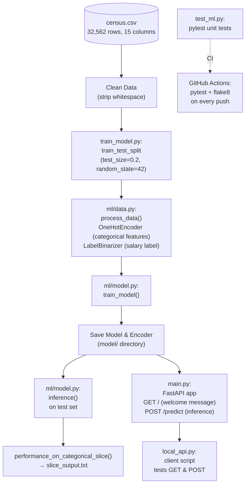

# Deploying a Scalable ML Pipeline with FastAPI

A production-style machine learning pipeline that trains a classifier on U.S. Census data and serves predictions through a RESTful API — built with continuous integration (GitHub Actions running pytest + flake8 on every push).

>  **Note:** This is a Udacity course project ("Deploying a Machine Learning Model with FastAPI," used to fulfill a WGU course requirement), forked from the official Udacity starter repository. It focuses on MLOps practices — testing, CI, model cards, and API deployment — more than on model accuracy itself.
> This repository is public because GitHub does not allow forks to be made private independently of their upstream repo. It is not intended as a "copy my homework" resource — if you're taking this course yourself, please do your own work.

---

## Business Problem

A trained model is only useful if it can be reliably reproduced, tested, and served to other systems — not just run once inside a notebook. This project tackles the **deployment side** of machine learning: taking a classification model (predicting whether an individual's income exceeds $50K/year from census attributes) and wrapping it in the engineering practices a real production system would need:

- **Repeatable training** via a versioned script rather than manual notebook execution
- **Automated testing** to catch breakage in data assumptions or model behavior before it ships
- **Continuous integration** so every code change is automatically validated
- **Sliced performance evaluation** to check the model isn't silently underperforming for specific subgroups
- **A documented model card** so anyone using the model understands what it does, how it was trained, and its known limitations
- **A REST API** so other applications can request predictions without needing direct access to the model file

This is the kind of foundation a company would need before trusting a model in a live product, rather than a one-off analysis.

---

## Dataset

This project uses the **U.S. Census Income dataset** (`census.csv`) — the same well-known dataset behind the classic "Finding Donors for CharityML" classification task.

- **Size:** 32,562 rows × 15 columns
- **Target variable:** `salary` (`<=50K` or `>50K`)
- **Categorical features used:** `workclass`, `education`, `marital-status`, `occupation`, `relationship`, `race`, `sex`, `native-country`
- **Note on data quality:** the raw CSV contains extraneous whitespace that must be cleaned before processing.

**Obtaining the data:** the cleaned `census.csv` is included in the `data/` directory of this repository (tracked via DVC per the project setup). If starting fresh, the original raw file is publicly available from the [UCI Machine Learning Repository](https://archive.ics.uci.edu/ml/datasets/Census+Income).

---

## Technologies Used

- **Python**
- **scikit-learn** — model training, `OneHotEncoder` for categorical features, `LabelBinarizer` for the target label
- **FastAPI** — REST API framework serving the trained model
- **uvicorn** — ASGI server running the FastAPI app
- **pytest** — unit testing (`test_ml.py`)
- **flake8** — linting/code-style enforcement
- **GitHub Actions** — CI pipeline running pytest and flake8 on every push
- **DVC** — data/model version control
- **requests** (via `local_api.py`) — client script for exercising the live API

---

## Architecture



**Pipeline summary:**
1. **`train_model.py`** loads and cleans `census.csv`, splits it into train/test sets (80/20, `random_state=42`), and calls `process_data()` to one-hot encode categorical features and binarize the target label.
2. **`ml/model.py`** trains the classifier (`train_model()`), runs inference on the test set, and saves both the trained model and the fitted encoder to the `model/` directory so they can be reused without retraining.
3. **`performance_on_categorical_slice()`** evaluates model performance broken out by each categorical feature value (e.g., performance for `race: Black` vs. `race: White`, or `sex: Male` vs. `sex: Female`), writing results to `slice_output.txt` — a key fairness/robustness check.
4. **`main.py`** exposes the trained model via a FastAPI app with a `GET` endpoint (welcome message) and a `POST` endpoint that runs live inference on submitted data.
5. **`local_api.py`** is a client script that calls the running API's `GET` and `POST` endpoints and prints the responses/status codes — used to verify the deployed API works end-to-end.
6. **`test_ml.py`** contains pytest unit tests covering core assumptions (no nulls in the test data, correct inference return type, expected `train_model` output).
7. **GitHub Actions** runs `pytest` and `flake8` automatically on every push, so the pipeline can't silently break.

---

## Setup and Execution

### Prerequisites
- Python 3.x
- Command-line environment (WSL recommended on Windows, per the original project notes)

### Installation

```bash
git clone https://github.com/ZinnNotZen/Deploying-a-Scalable-ML-Pipeline-with-FastAPI.git
cd Deploying-a-Scalable-ML-Pipeline-with-FastAPI

# Option 1: conda
conda env create -f environment.yml

# Option 2: pip
pip install -r requirements.txt
```

### Training the model

```bash
python train_model.py
```
This cleans the data, trains the model, saves the model/encoder to `model/`, and writes categorical slice performance to `slice_output.txt`.

### Running the tests

```bash
pytest test_ml.py
flake8
```

### Serving the API

```bash
uvicorn main:app --reload
```

In a separate terminal, exercise the live API:

```bash
python local_api.py
```

This sends a `GET` request to the root endpoint and a `POST` request for model inference, printing the status codes and results of each.

---

## Sample Outputs

**Final model performance (full test set):**

```
Precision: 0.7424
Recall:    0.6365
F1:        0.6854
```

**Sliced performance** (`slice_output.txt`) breaks these same metrics out across every value of each categorical feature — e.g. `workclass`, `education`, `marital-status`, `occupation`, `relationship`, `race`, `sex`, and `native-country` — so performance can be checked for any subgroup rather than only in aggregate.

**Unit tests (`test_ml.py`):** 3 tests covering (1) no nulls/NaNs in the test dataset, (2) `inference()` returns the expected type, and (3) `train_model()` returns the expected result — all passing. See the `screenshots/` folder for the actual pytest run output.

**API verification:** `screenshots/` also includes confirmation of the live `GET`/`POST` responses from `local_api.py`, and a screenshot of the GitHub Actions workflow passing both the pytest and flake8 checks.

*(Consider embedding the actual screenshot images directly in this README for a stronger visual — e.g. ``.)*

---

## Key Findings and Lessons Learned

- **Categorical slice performance came out identical across all slices in this run.** Looking at `slice_output.txt`, the precision/recall/F1 values are the same for every value within a given training run — worth double-checking whether `performance_on_categorical_slice()` is actually filtering to each subgroup correctly, or computing the overall metric repeatedly. This is exactly the kind of bug that's easy to miss without a sanity check, and exactly why slice evaluation is a recommended MLOps practice in the first place.
- **A small, fixed feature set has real limits.** As noted directly in the model card, this model has no information about a person's history (years of experience, family wealth growing up, career trajectory) — only a snapshot of current attributes. It's a reasonable starting point for exploring income patterns, but shouldn't be treated as an explanation of *why* someone earns what they do.
- **Testing the full path — not just the model — matters.** The unit tests here intentionally check data integrity (no nulls), function output types, and training behavior, not just final accuracy. Catching a malformed return type or a data leak early is often more valuable day-to-day than chasing marginal accuracy gains.
- **CI catches what manual testing misses.** Automating `pytest` and `flake8` on every push means code style and test regressions are caught immediately, rather than discovered later (or never) in a manual review.

> ⚠️ **Worth revisiting:** the current model card's Ethical Considerations section states the data contains no sensitive factors or protected classes — but the feature set includes `race`, `sex`, and `native-country`, which are commonly considered protected/sensitive attributes. Since `performance_on_categorical_slice()` already breaks out results by these exact features, it's worth using that output to check for performance disparities across race/sex groups and updating the model card's ethical considerations to reflect what's actually in the data.

---

## Possible Extensions

- Fix and re-verify `performance_on_categorical_slice()` so slice metrics genuinely reflect each subgroup, and use that output to check for fairness disparities across `race` and `sex`
- Add integration tests that spin up the FastAPI app and hit the live endpoints (rather than only unit-testing the underlying functions)
- Containerize the app (Dockerfile) for more portable deployment beyond a local `uvicorn` server
- Add input validation/error handling to the `POST` endpoint for malformed requests
- Track model versions and metrics over time (e.g., via MLflow or DVC pipelines) rather than overwriting `slice_output.txt` on each run
